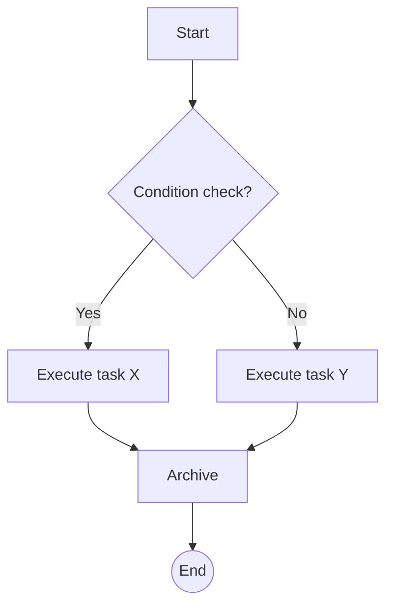
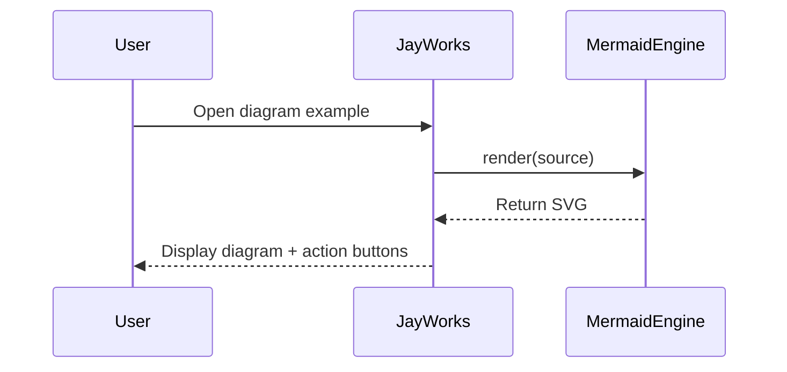
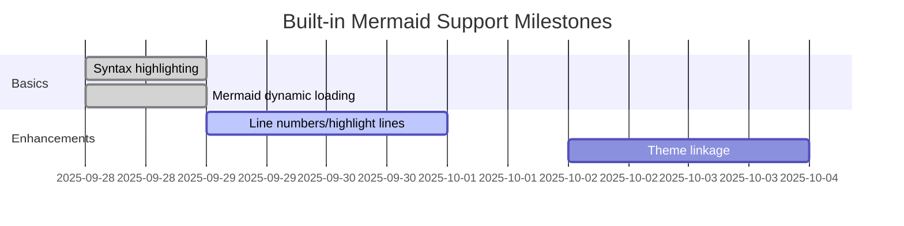
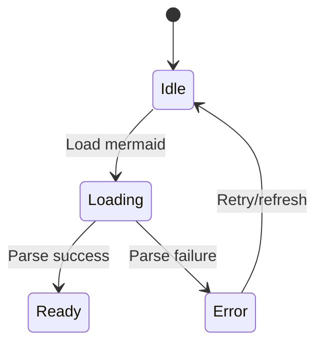
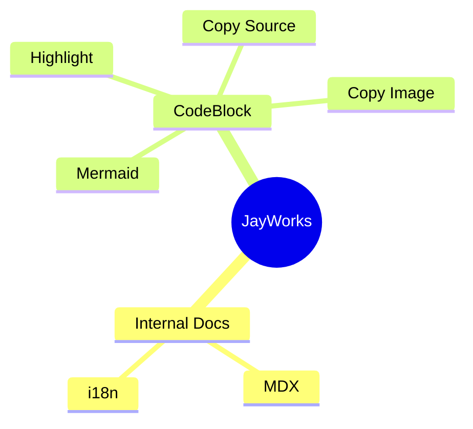

This page showcases common Mermaid syntax and current implementation goals:

1. Code blocks marked with ```mermaid support "Source / Diagram" dual tab switching.
2. Support copying source; copying images (prioritize SVG, fallback to PNG on failure).
3. Provide error prompts and fallbacks on rendering failure.

> Theme linkage, line numbers/highlighting, folding long diagrams, etc., are still in planning.

## Flowchart



## Sequence Diagram



## Gantt Chart



## State Diagram



## Mind Map (Experimental)



---
Future enhancement directions:

- Automatically switch Mermaid themes based on system/theme.
- Allow folding lengthy diagram areas.
- Export to PNG / SVG to Vault.

Welcome to propose additional examples or enhancement suggestions in issues.