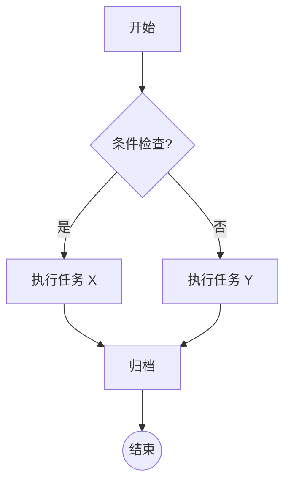
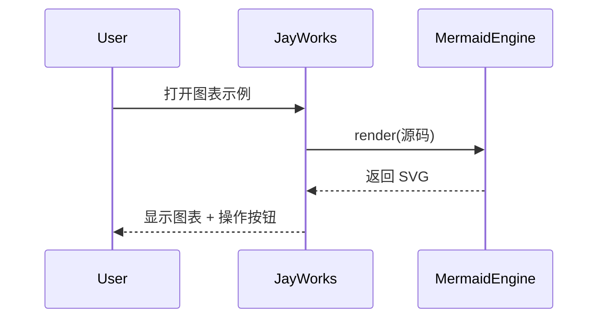
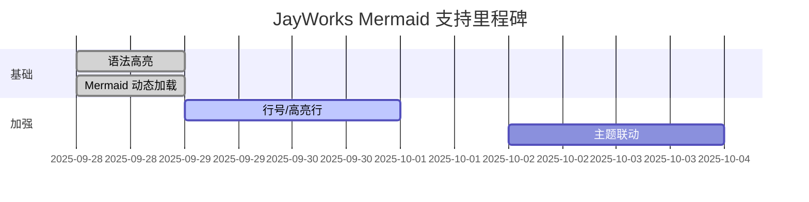
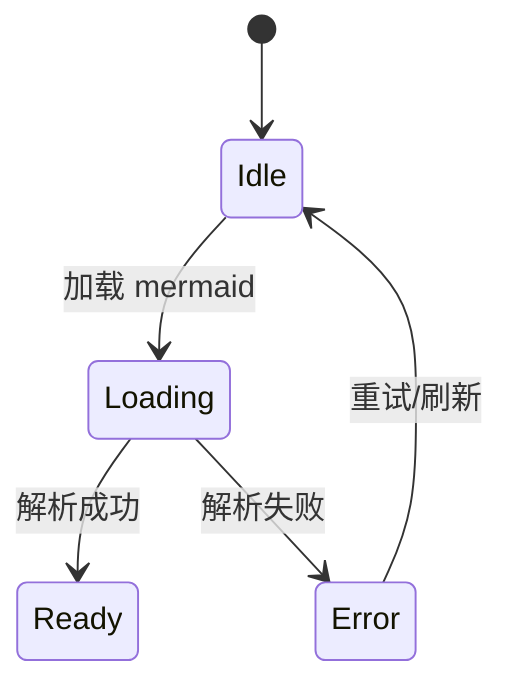
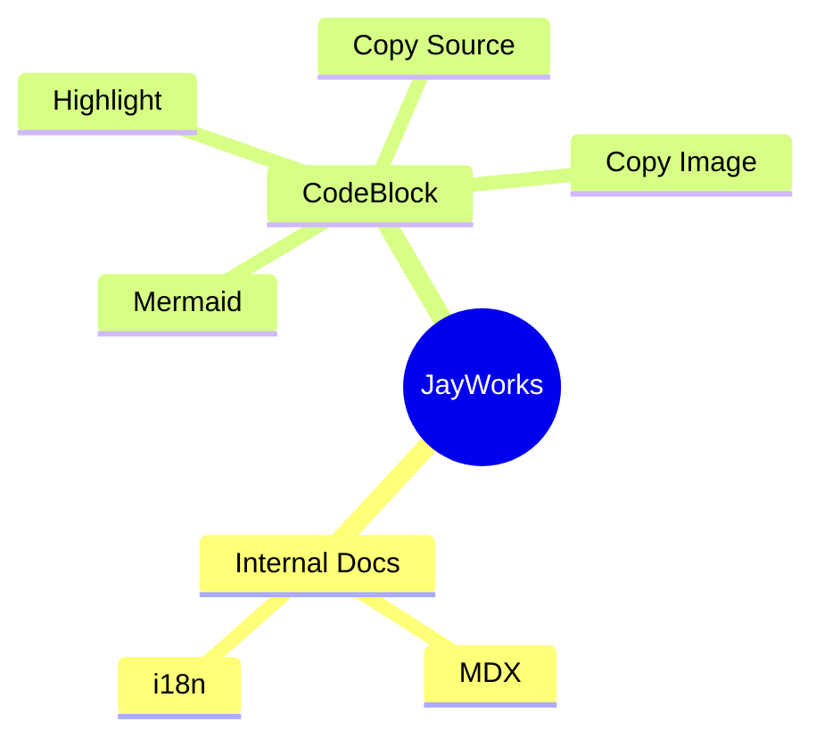

# Mermaid 图表示例

本页展示多种常见 Mermaid 语法，并验证：

1. 代码块以 ` ```mermaid ` 标记后会出现 “源码 / 图表” 双标签。
2. “复制源码” 将复制原始 mermaid 文本。
3. “复制图片” 优先复制 SVG（支持粘贴到大多数富文本编辑器）；不支持时回退 PNG。
4. 渲染失败时会显示错误信息并可切换回源码。

> 小贴士：切换标签后不会重新编译 mermaid，除非源码内容（文档刷新）发生变化。

## 流程图 (Flowchart)



## 时序图 (Sequence)



## 甘特图 (Gantt)



## 状态图 (State Diagram)



## 思维导图 (Mindmap) (如果版本支持)



---

### 可能的后续增强

- 根据 Obsidian 主题或系统暗色模式自动切换 Mermaid 主题。
- 支持行号与行高亮（对源码 tab）。
- 按需折叠长图表区域，并提供“展开/收起”按钮。
- 集成导出：一键导出为 PNG / SVG 文件到当前 Vault。

欢迎继续在此页追加更多语法案例用于回归测试。

