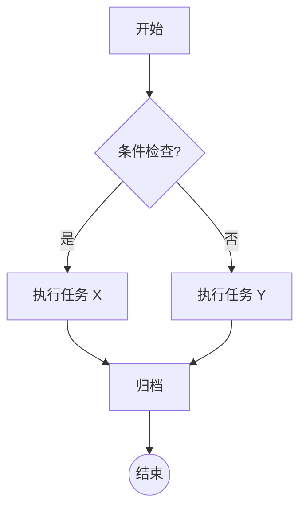
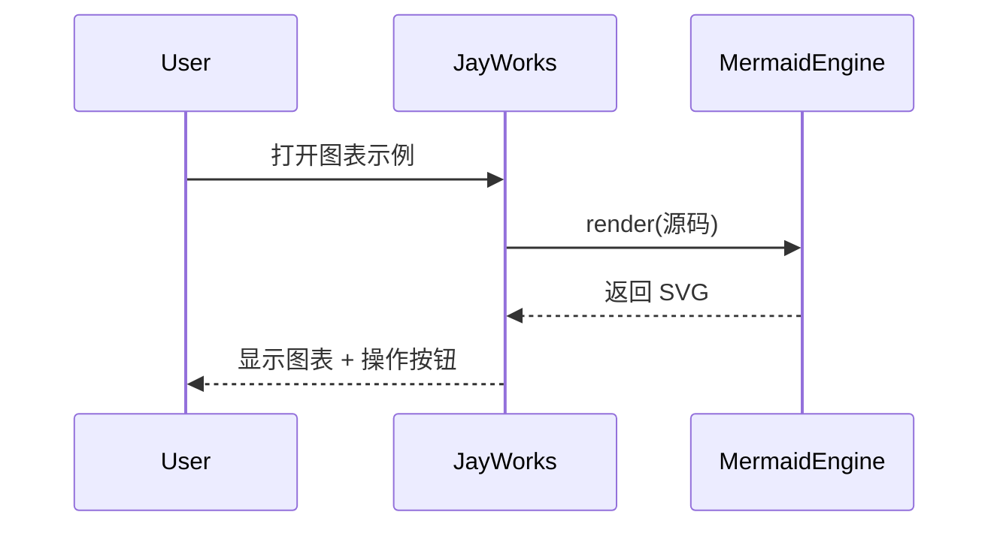
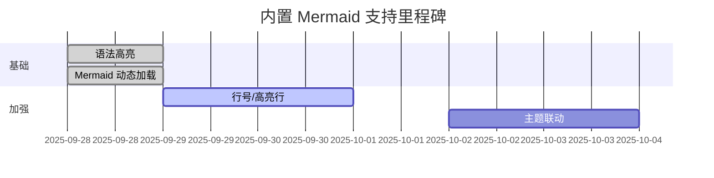
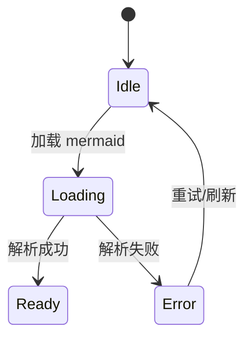
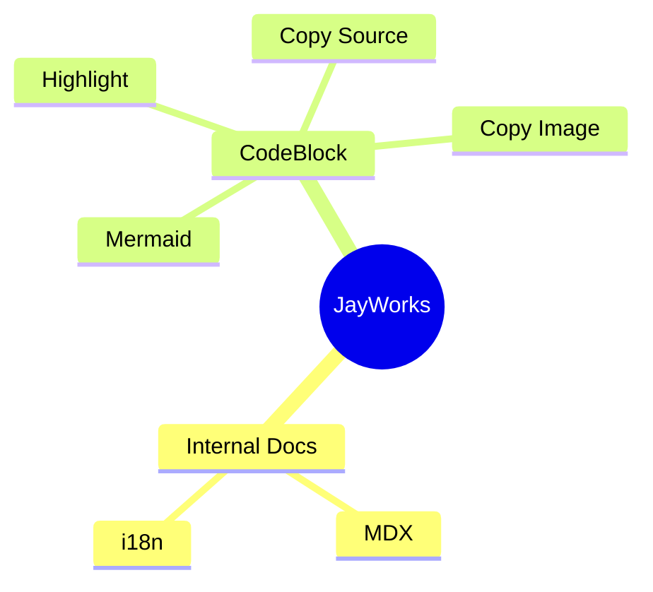

本页展示常见 Mermaid 语法及当前实现目标：

1. 代码块以 ```mermaid 标记后支持“源码 / 图表”双标签切换。
2. 支持复制源码；复制图片（优先 SVG，失败时回退 PNG）。
3. 渲染失败时提供错误提示与回退。

> 主题联动、行号/高亮、折叠长图等特性仍在规划中。

## 流程图



## 时序图



## 甘特图



## 状态图



## 思维导图（实验性）



---
未来增强方向：

- 按系统/主题自动切换 Mermaid 主题。
- 允许折叠冗长图表区域。
- 导出为 PNG / SVG 到 Vault。

欢迎在 issue 中提出补充示例或增强建议。
